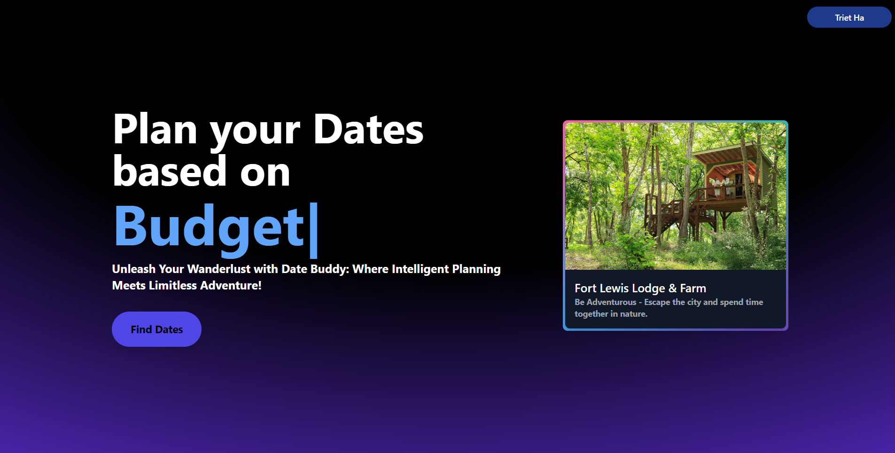
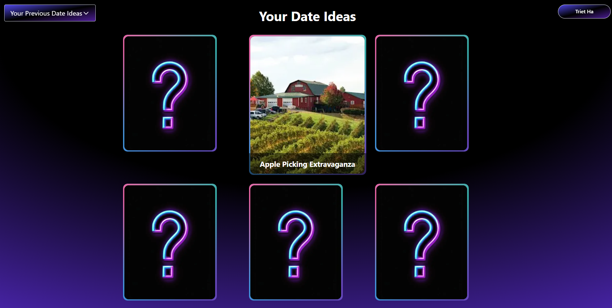
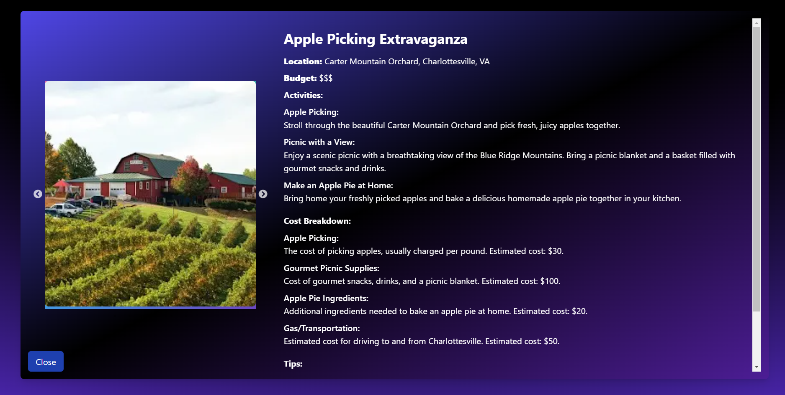

# SmartBrain

    <h2>Date Buddy</h1>
        <h4>
            Built with <a href="[https://create-react-app.dev/](https://nextjs.org/)">Create next-app</a> &
        </h4>

<h3 align='center'>Technologies & Tool:</h3>
 

  

 
DateBuddy is a full-stack web application designed to help users find and plan perfect date ideas based on their mood, budget, and location.
 The app leverages AI to generate personalized date suggestions and integrates with various APIs to provide a seamless user experience.

The front-end, built with Next.js and Tailwind CSS, allows users to input their preferences and receive tailored date ideas. 
The backend, powered by Node.js and MongoDB, handles user authentication, data storage, and API integrations.

### :camera: A demo of the Web App

## :key: Features
As a user, you can:

- Login/Log out or set up a new account (Register)
- Input your mood, budget, and location to receive date ideas
- View detailed date suggestions with activities, cost breakdowns, and tips
- See images and websites related to the suggested date locations
- Save your favorite date ideas for future reference

## :hammer: Project Structure

The app consists of:

- A Next.js frontend with server-side rendering
- Tailwind CSS for styling and responsive design
- React hooks for state management
- Integration with OpenAI API and Puppeteer for generating date ideas
- Google Maps API and SerpAPI for location-based/theme searches
- NextAuth.js for user authentication with Google and GitHub providers
- Node.js and Express backend hosted on Vercel
- MongoDB for storing user data and date ideas
- API routes on the backend for processing user inputs and fetching data
